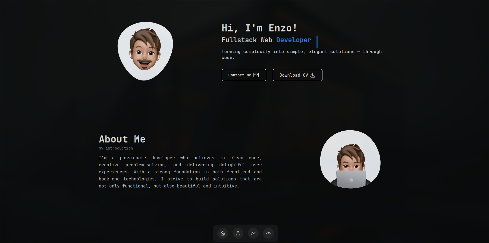

# Portfólio


Este é o repositório do meu portfólio pessoal, atualmente em desenvolvimento, criado com Next.js, Tailwind CSS e TypeScript.

## Protótipo




Você pode acessar o protótipo [aqui](link-do-prototipo-online).

## Índice

- [Descrição](#descrição)
- [Tecnologias Utilizadas](#tecnologias-utilizadas)
- [Instalação](#instalação)

## Descrição

Este portfólio tem como objetivo apresentar meus projetos, habilidades e experiência profissional. Ele está sendo desenvolvido com foco em desempenho, acessibilidade e design moderno.

## Tecnologias Utilizadas

- **[Next.js](https://nextjs.org/)** - Framework React para desenvolvimento de aplicações web.
- **[Tailwind CSS](https://tailwindcss.com/)** - Framework CSS utilitário para rápida estilização.
- **[TypeScript](https://www.typescriptlang.org/)** - Superset do JavaScript que adiciona tipagem estática.

## Instalação

Para clonar e executar este projeto, você precisará do [Git](https://git-scm.com), [Node.js](https://nodejs.org/), [npm](https://www.npmjs.com/) ou [yarn](https://yarnpkg.com/):

```bash
# Clone o repositório
git clone https://github.com/Rodriguessz/Portfolio.git

# Entre no diretório do projeto
cd portfolio-pessoal

# Instale as dependências
npm install 
# ou
yarn install
